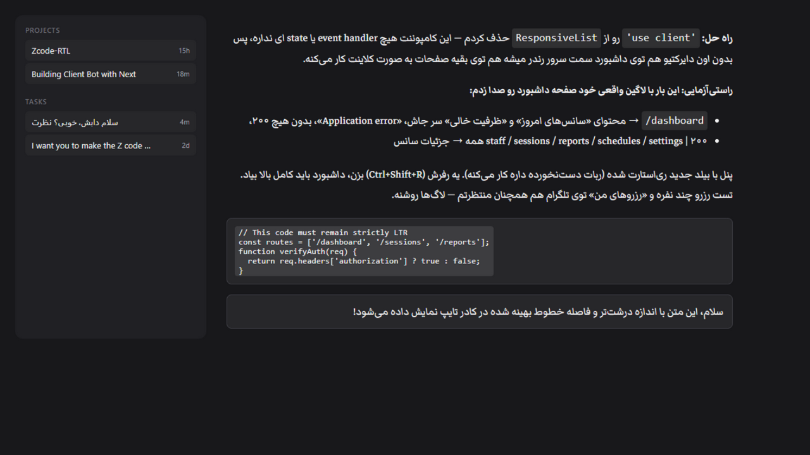

# ZCode RTL Patch

Adds automatic **right-to-left text direction** and **Markazi Text typography** to
[ZCode Desktop](https://z.ai) for **Arabic, Persian, Hebrew, Urdu** and other RTL
scripts — chat messages, markdown content, and the message composer all follow the
natural direction of their text.



## What it does

- **Smart RTL Detection** — does not just look at the first character:
  - **Ignores inline code prefixes** like `<code>/dashboard</code> → محتوای ...`,
    correctly recognizing the sentence as RTL.
  - **Overall text balance**: if RTL characters outnumber LTR characters, the block
    is RTL even if an English word starts the sentence.
  - **English-prefixed technical sentences**: lines starting with English route
    names or keywords that finish with a Persian/Arabic explanation (e.g.
    `staff / sessions / reports | همه جزئیات`) are recognized as RTL.
- **Balanced Markazi Text Typography (v1.5)**:
  - Font size increased to **1.28em** for clear, legible Persian/Arabic reading.
  - Line-height carefully tuned to **1.58** to keep vertical line spacing compact
    and avoid oversized vertical line gaps.
  - Inline code scaled to **0.82em** to seamlessly match the visual x-height of
    Markazi Text.
  - 100% offline with bundled local WOFF2 and TTF fonts.
- **User Messages & Chat Bubbles (v1.6)** — user sent message bubbles (`[data-v4-user-input-bubble]`)
  are directly detected and formatted with Markazi Text, right alignment, and 1.28em typography.
- **Multiline Rich-Text Composer (v1.6)** — in the Lexical composer, each paragraph/line
  is evaluated independently: Persian lines right-align in Markazi Text, while English lines
  (like `Hi`) remain left-aligned in the system UI font.
- **Protected Navigation Chrome (v1.5)** — sidebars, project trees, and task
  history items stay strictly in their clean, compact LTR layout with system UI fonts;
  timestamps (e.g. "4m", "15h") remain pinned to the right edge.
- **Protected surfaces** — code blocks, inline code, math (KaTeX), the terminal
  (xterm) and code editors (Monaco / CodeMirror) stay strictly left-to-right and monospace.
- **Safe installer** — never auto-launches the app after patching; you open ZCode
  manually when ready.

## Install

Requirements: **Windows**, **ZCode Desktop**, **Node.js 18+** (for the build step).

```
git clone https://github.com/Venom-xpr/zcode-rtl-patch.git
cd zcode-rtl-patch
build.cmd      :: builds dist\app-patched.asar from YOUR installed ZCode (~2 min)
install.cmd    :: closes ZCode, backs up, installs, verifies
```

Once installed, start ZCode manually — done! Nothing else is modified: your
settings, chats and native modules stay untouched. The original `app.asar` is
backed up automatically before anything changes.

> The patch archive is **not distributed in this repo** — `build.cmd` creates it
> from your own installed copy, so it always matches your ZCode version and
> nothing proprietary is redistributed.

## Uninstall

Run `uninstall.cmd` — it restores the original `app.asar` from the backup.

After a **ZCode app update** the patch is gone (the updater replaces the
archive) — just run `build.cmd` + `install.cmd` again.

## How it works

ZCode Desktop is an Electron app whose UI lives in `resources/app.asar`. The
build script:

1. extracts the archive,
2. copies [`patch/rtl-patch.js`](patch/rtl-patch.js),
   [`patch/rtl-patch.css`](patch/rtl-patch.css), and the bundled
   Markazi Text fonts into the renderer assets,
3. injects references into `out/renderer/index.html` (after the app stylesheet,
   before the deferred module bundle),
4. repacks, keeping native binaries (`*.{node,dll,exe}`) unpacked,
5. verifies the patched files inside the new archive.

You can try the detection engine standalone: serve the repository with any
static server (`npx serve .`) and open `/test/index.html` in a browser.

## Compatibility & notes

- Built and tested against ZCode Desktop on Windows x64.
- The installer is interactive, self-elevating, and verifies the copied file
  before reporting success; on any failure it restores the original archive.
- If ZCode is installed in a non-default location, pass it to the build:
  `node build\build-patch.js --resources "D:\Apps\ZCode\resources"`.

## Legal

This patch is released under the [MIT License](LICENSE). Markazi Text font is
licensed under the [SIL Open Font License](http://scripts.sil.org/OFL).
It contains **no** ZCode application code — it modifies your locally installed
copy on your machine. ZCode is a product of Z.ai; this project is not affiliated
with or endorsed by Z.ai.

---

## فارسی

این پروژه، متن راست‌به‌چپ هوشمند و فونت زیبای **مرکزی (Markazi Text)** را به
برنامه‌ی دسکتاپ ZCode اضافه می‌کند:

- **تشخیص هوشمند راست‌به‌چپ**:
  - کدهای درون‌خطی در اول جمله نادیده گرفته می‌شوند (مثلاً `<code>/dashboard</code> → محتوای...` به درستی راست‌چین می‌شود).
  - جملاتی که با کلمات انگلیسی شروع می‌شوند اما ادامه‌شان فارسی است بر اساس تعادل متن و انتهای جمله راست‌چین می‌شوند.
  - کادر نوشتن متن جهت تایپ شما را دنبال می‌کند (با پشتیبانی از ادیتور Lexical).
- **پشتیبانی کامل از پیام‌های کاربر و کادر تایپ (v1.6)**:
  - حباب‌های پیام ارسالی کاربر (`[data-v4-user-input-bubble]`) به طور اختصاصی شناسایی و با فونت مرکزی و راست‌چین رندر می‌شوند.
  - در کادر تایپ چندخطی، هر سطر به صورت مستقل جهت‌دهی می‌شود؛ سطرهای فارسی راست‌چین با فونت مرکزی و سطرهای انگلیسی (مثل `Hi`) چپ‌به‌راست با فونت انگلیسی باقی می‌مانند.
- **تایپوگرافی بهینه مرکزی (v1.5)**:
  - اندازه فونت به ۱.۲۸ برابر برای خوانایی عالی بزرگ‌تر شده است.
  - ضریب فاصله خطوط روی ۱.۵۸ تنظیم شده تا سطرها فشرده و متوازن بمانند و فاصله عمودی اضافی ایجاد نشود.
  - کدهای درون‌خطی به صورت متناسب با فونت فارسی هم‌تراز شده‌اند.
- **تفکیک کامل سایدبار و ناوبری (v1.5)**:
  - چیدمان تسک‌ها و پروژه‌ها در سایدبار کاملاً چپ‌به‌راست با فونت سیستمی باقی می‌ماند و زمان تسک‌ها ("4m", "2d") در سمت راست قفل است.
- **بلوک‌های کد و ترمینال**:
  - کدهای برنامه‌نویسی و ترمینال همواره چپ‌به‌راست و مونو‌اسپیس باقی می‌مانند.
- **نصب کاملاً امن**:
  - نصاب بعد از پچ کردن برنامه را خودکار باز نمی‌کند و فایل اصلی نسخه پشتیبان گرفته می‌شود.

نصب (ویندوز + Node.js):

```
git clone https://github.com/Venom-xpr/zcode-rtl-patch.git
cd zcode-rtl-patch
build.cmd       ← ساخت نسخه‌ی وصله‌شده از نصب فعلی ZCode روی سیستم شما
install.cmd     ← بستن ZCode، پشتیبان‌گیری، نصب و تأیید
```

حذف: اجرای `uninstall.cmd` نسخه‌ی اصلی `app.asar` را برمی‌گرداند.
بعد از به‌روزرسانی ZCode کافی است دوباره همین دو دستور را اجرا کنید.
